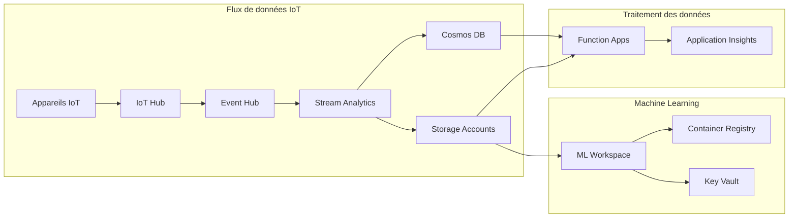
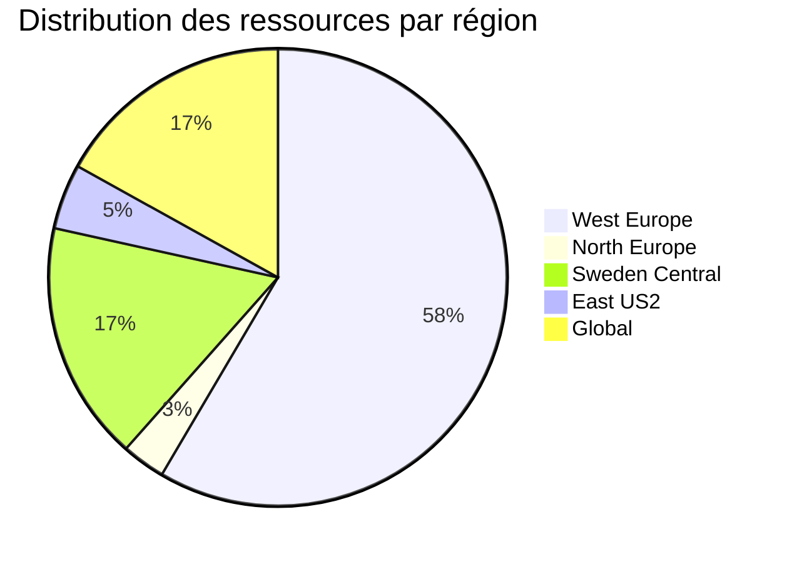

# Cartographie complète des ressources Azure - Smart Building

**Date d'analyse**: 2025-06-24

**Environnement**: Azure - Subscription Business-Labino-staging  

**Resource Group**: rg-smart-building  

---
[← Retour à l'index](./readme.md) 

---

## Vue d'ensemble

Cette cartographie présente l'inventaire exhaustif de toutes les ressources Azure déployées dans le cadre du projet Smart Building.

### Relations entre services principaux

### Statistiques globales

- **Souscription** : Business-Labino-staging
- **Groupe de ressources principal** : rg-smart-building
- **Nombre total de ressources** : 64 (+1) ressources actives
- **Régions utilisées** : 5 régions
  - West Europe (38 ressources)
  - North Europe (1 + (1) resources) (DR)
  - Sweden Central (11 ressources)
  - East US2 (3 ressources)
  - Global (11 ressources)

### Distribution par type de service

| Type de service | Nombre de ressources | West Europe | North Europe | Sweden Central | East US2 | Global |
|----------------|---------------------|-------------|-------------|----------------|----------|--------|
| Storage Accounts | 10 | 3 | 0 | 4 | 3 | 0 |
| App Service Plans | 11 | 6 | 0 | 5 | 0 | 0 |
| Private DNS Zones | 11 | 0 | 0 | 0 | 0 | 11 |
| Application Insights | 7 | 5 | 0 | 2 | 0 | 0 |
| App Services (Function Apps) | 6 | 6 | 0 | 0 | 0 | 0 |
| Virtual Networks | 3 | 3 | 0 | 0 | 0 | 0 |
| Cosmos DB | 3 | 3 | (1) | 0 | 0 | 0 |
| Managed Identities | 2 | 2 | 0 | 0 | 0 | 0 |
| IoT Hubs | 2 | 1 | 1 | 0 | 0 | 0 |
| Stream Analytics Jobs | 1 | 1 | 0 | 0 | 0 | 0 |
| Container Registries | 1 | 1 | 0 | 0 | 0 | 0 |
| Workspaces (Log Analytics) | 1 | 1 | 0 | 0 | 0 | 0 |
| Public IPs | 1 | 1 | 0 | 0 | 0 | 0 |
| Network Security Groups | 1 | 1 | 0 | 0 | 0 | 0 |
| Key Vaults | 1 | 1 | 0 | 0 | 0 | 0 |
| Event Hubs | 1 | 1 | 0 | 0 | 0 | 0 |
| Machine Learning | 1 | 1 | 0 | 0 | 0 | 0 |
| VNET Gateways | 1 | 1 | 0 | 0 | 0 | 0 |

## Inventaire détaillé des ressources

### 1. Infrastructure réseau

#### Virtual Networks
| Nom | Région | Espace d'adressage | Sous-réseaux | Protection DDoS |
|-----|--------|-------------------|--------------|-----------------|
| VnetAzure | West Europe | 10.0.0.0/16 | 3 sous-réseaux | Désactivée |

**Détail des sous-réseaux :**
- **default** : 10.0.0.0/24 (251 IPs disponibles, 0 utilisée)
  - NSG : NSG
  - Table de routage : route-table
- **default2** : 10.0.254.0/24 (251 IPs disponibles, 0 utilisée)
  - NSG : NSG
  - Table de routage : route-table
  - Délégation : Microsoft.StreamAnalytics/streamingjobs
- **GatewaySubnet** : 10.0.1.0/24 (250 IPs disponibles, 1 utilisée)

#### Network Security Groups
| Nom | Région | État | Associations | Flow Logs Enabled |
|-----|--------|------|--------------|--------------|
| NSG | West Europe | Actif | VnetAzure (default, default2) | False |

#### Public IPs
| Nom | Type | Version | Adresse IP | Utilisation |
|-----|------|---------|------------|-------------|
| VnetAzureGWIP | Dynamic | IPv4 | 52.157.104.18 | VnetAzureGW |

#### VPN Gateway
| Nom | Région | SKU | Type | Génération |
|-----|--------|-----|------|------------|
| VnetAzureGW | West Europe | Basic | VPN RouteBased | Generation2 |

### 2. Stockage

#### Storage Accounts
| Nom | Région | SKU | Tier | Type | Sécurité | Tags |
|-----|--------|-----|------|------|----------|------|
| mlworkspace2826009716 | West Europe | Standard_LRS | Standard | StorageV2 | TLS 1.2 | - |
| rgsmartbuilding9137 | Sweden Central | Standard_LRS | Standard | Storage | TLS 1.2 | - |
| rgsmartbuilding950d | East US2 | Standard_LRS | Standard | Storage | TLS 1.2 | - |
| rgsmartbuildinga1b6 | Sweden Central | Standard_ZRS | Standard | StorageV2 | TLS 1.2 | - |
| rgsmartbuildinga888 | West Europe | Standard_LRS | Standard | Storage | TLS 1.2 | - |
| rgsmartbuildingad52 | West Europe | Standard_LRS | Standard | StorageV2 | TLS 1.2 | - |
| rgsmartbuildingb026 | Sweden Central | Standard_LRS | Standard | Storage | TLS 1.2 | - |
| rgsmartbuildingb960 | Sweden Central | Standard_LRS | Standard | Storage | TLS 1.2 | - |
| rgsmartbuildingbc94 | East US2 | Standard_LRS | Standard | Storage | TLS 1.2 | - |
| supprimerdatacleancosmos | East US2 | Standard_LRS | Standard | Storage | TLS 1.2 | - |

**Note** : Le compte de stockage `rgsmartbuildingad52` a des configurations spécifiques :
- Namespace hiérarchique activé
- Access Tier : Cool
- Restrictions réseau avec IPs autorisées : 176.144.223.98, 176.162.164.177

### 3. Compute

#### App Service Plans
| Nom | Région | Pricing Tier | État | Type OS | Applications |
|-----|--------|--------------|------|---------|--------------|
| ASP-rgSmartBuilding-9e7b | West Europe | Basic(B1: 1) | Actif | Linux | 2 apps |
| ASP-rgSmartBuilding-b623 | West Europe | FlexConsumption | Actif | Linux | 1 app |
| ASP-rgSmartBuilding-80fb | Sweden Central | Dynamic(Y1) | Orphelin | Linux | 0 apps |
| ASP-rgSmartBuilding-9023 | West Europe | FlexConsumption | Orphelin | Linux | 0 apps |
| ASP-rgSmartBuilding-9d8c | Sweden Central | Premium0V3 | Orphelin | Linux | 0 apps |
| ASP-rgSmartBuilding-a043 | Sweden Central | FlexConsumption | Orphelin | Linux | 0 apps |
| ASP-rgSmartBuilding-a5e9 | Sweden Central | FlexConsumption | Orphelin | Linux | 0 apps |
| ASP-rgSmartBuilding-ad53 | West Europe | FlexConsumption | Orphelin | Linux | 0 apps |
| ASP-rgSmartBuilding-b34e | Sweden Central | Dynamic(Y1) | Orphelin | Linux | 0 apps |
| ASP-rgSmartBuilding-b458 | West Europe | FlexConsumption | Orphelin | Linux | 0 apps |
| ASP-rgSmartBuilding-b8b3 | West Europe | FlexConsumption | Orphelin | Linux | 0 apps |

**Ressources orphelines identifiées** : 9 App Service Plans sans applications associées

#### Function Apps
| Nom | Région | SKU | Runtime | État |
|-----|--------|-----|---------|------|
| DataProcessingPerSensor | West Europe | FlexConsumption | Linux | Running |
| DataProcessingSmartBuilding | West Europe | Basic | Python 3.10 | Running |
| sensordata-clean | West Europe | Basic | Python 3.11 | Running |

### 4. Données

#### Cosmos DB
| Nom | Région | API | Politique de sauvegarde | Réplication | Tags |
|-----|--------|-----|------------------------|-------------|------|
| cosmosdb-chateaudun-paris | West Europe | SQL | Periodic | Désactivée | defaultexperience:core (sql) |
| cosmosdb-paris-chateaudun | West Europe | SQL | Periodic | Multi-région (North Europe) | data-storage:iot, team:infra |
| cosmosdb-paris-chateaudun-test | West Europe | SQL | Periodic | Désactivée | team:infra, branch:testdata |

### 5. IoT et Analytics

#### IoT Hubs
| Nom | Régions | État | Partitions | Rétention |
|-----|---------|------|------------|-----------|
| IOT-Hub-Paris-Chateaudun | West Europe (primaire), North Europe (secondaire) | Active | 4 | 1 jour |

#### Event Hubs
| Nom | Région | SKU | Unités de débit | Kafka |
|-----|--------|-----|------------------|-------|
| eventhubs-paris-chateaudun | West Europe | Standard | 2 | Activé |

#### Stream Analytics Jobs
| Nom | Région | Plan | État | Niveau de compatibilité |
|-----|--------|------|------|------------------------|
| SensorDataIngest | West Europe | StandardV2 | Running | 1.2 |

### 6. Monitoring et Insights

#### Application Insights
| Nom | Région | Type | Rétention | Source |
|-----|--------|------|-----------|--------|
| mlworkspace7825232448 | West Europe | web | 90 jours | AzureMachineLearningStudio |
| DataCleanCosmos | West Europe | web | 90 jours | IbizaWebAppExtensionCreate |
| DataProcessingPerSensor | West Europe | web | 90 jours | IbizaWebAppExtensionCreate |
| DataProcessingSB | Sweden Central | web | 90 jours | IbizaWebAppExtensionCreate |
| FuncAppSmartBuilding | Sweden Central | web | 90 jours | IbizaWebAppExtensionCreate |
| new-sensor-data-clean | West Europe | web | 90 jours | IbizaWebAppExtensionCreate |
| sensordata-clean | West Europe | web | 90 jours | IbizaWebAppExtensionCreate |

#### Log Analytics Workspace
| Nom | Région | SKU | Rétention |
|-----|--------|-----|-----------|
| workspace-funcapptestlaila | Sweden Central | PerGB2018 | 30 jours |

### 7. Sécurité et Identité

#### Key Vault
| Nom | Région | SKU | URI |
|-----|--------|-----|-----|
| mlworkspace0664747193 | West Europe | Standard | https://mlworkspace0664747193.vault.azure.net/ |

#### Managed Identities
| Nom | Région | Type | Client ID |
|-----|--------|------|-----------|
| processing_per_sensor_id | West Europe | User Assigned | fe4ec9f7-f5df-4052-a5ed-1c74eebe757e |

### 8. Machine Learning

#### ML Workspace
| Nom | Région | SKU | Storage | Key Vault | App Insights |
|-----|--------|-----|---------|-----------|--------------|
| ml-workspace | West Europe | Basic | mlworkspace2826009716 | mlworkspace0664747193 | mlworkspace7825232448 |

### 9. Container Registry
| Nom | Région | SKU | Chiffrement | Tags |
|-----|--------|-----|-------------|------|
| f655055312c54547a1f401d449d3983d | West Europe | Basic | Désactivé | branch:data, team:datascience |

### 10. DNS privé

#### Private DNS Zones (11 zones)
Toutes les zones DNS privées sont liées au réseau virtuel VnetAzure :
- privatelink.api.azureml.ms
- privatelink.azure-devices.net
- privatelink.azurewebsites.net
- privatelink.blob.core.windows.net
- privatelink.dfs.core.windows.net
- privatelink.documents.azure.com
- privatelink.file.core.windows.net
- privatelink.notebooks.azure.net
- privatelink.queue.core.windows.net
- privatelink.servicebus.windows.net
- privatelink.table.core.windows.net

## Analyse des anomalies

### Anomalies détectées

#### 1. Ressources orphelines (11 ressources)
- **11 App Service Plans** dont 9 sans applications associées
  - Coût potentiel sans valeur ajoutée
  - Régions : West Europe (6), Sweden Central (5)
  - Tous en état "orphelin" sauf 2 actifs

#### 2. Incohérences de région
- Ressources non globales distribuées sur 4 régions différentes
- Storage accounts dans 3 régions (West Europe, Sweden Central, East US2)
- Pas de stratégie claire de distribution régionale

#### 3. Ressources sans tags
- La majorité des ressources n'ont pas de tags
- Difficile de déterminer l'environnement (dev/test/prod)
- Impossible d'identifier le propriétaire ou l'équipe responsable

#### 4. Sécurité
- Accès public activé sur la plupart des ressources
- Un seul Key Vault pour tout l'environnement
- Private endpoints non configurés malgré la présence de Private DNS zones

#### 5. Nommage incohérent
- Storage accounts avec des noms peu descriptifs (ex: rgsmartbuilding950d)
- Mélange de conventions de nommage, pas de logique (rgsmartbuildingxxx, supprimerdatacleancosmos, mlworkspace2826009716)

#### 6. Configuration réseau
- VPN Gateway Basic SKU (limitations de performance)
- NSG sans règles personnalisées apparentes
- Flow logs désactivés sur le NSG

---

*Fin du rapport de cartographie des ressources Azure*