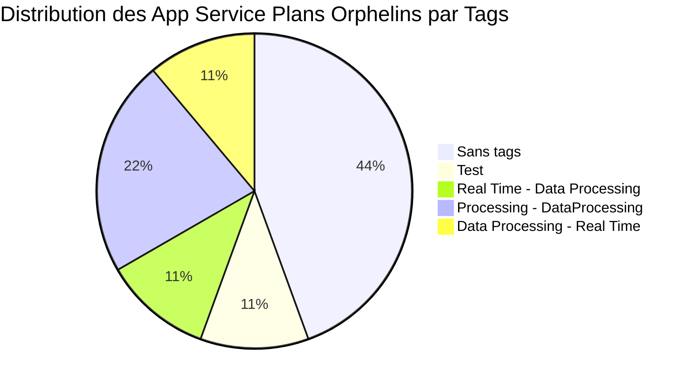
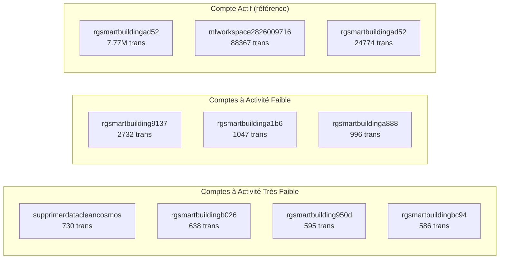
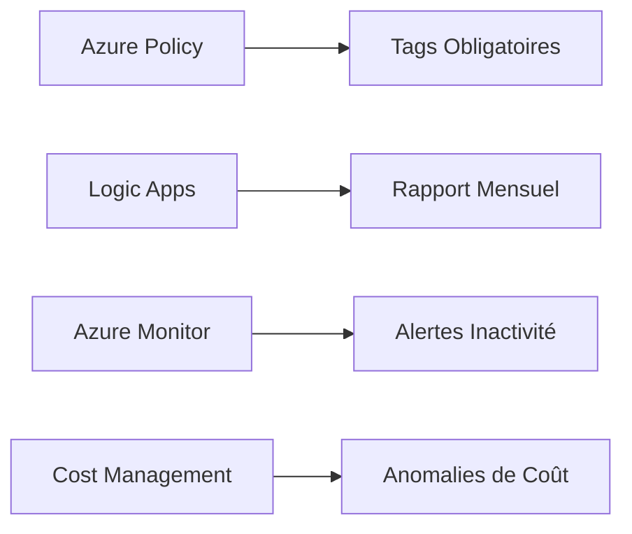

# Rapport d'Analyse des Ressources Orphelines et Inutilisées

**Date d'analyse**: 2025-06-25

**Environnement**: Azure - Subscription Business-Labino-staging  

**Resource Group**: rg-smart-building  

---
[← Retour à l'index](./readme.md) 

---

## Résumé Exécutif

L'analyse approfondie a révélé **plusieurs ressources potentiellement orphelines ou inutilisées**. Ces ressources incluent principalement des App Service Plans orphelins, des comptes de stockage à faible activité et des ressources de test.

### Chiffres Clés
- **9/11 App Service Plans orphelins** (83,33% du total)
- **7/10 comptes de stockage** avec activité très faible ou nulle
- **2/3 bases de données Cosmos DB** incluant des environnements de test ou peu utilisés
- **Économies potentielles**: 50-100 EUR/mois soit **600-1 200 EUR/an**

---

## 1. Ressources Orphelines Identifiées

### 1.1 App Service Plans Orphelins
**9 App Service Plans orphelins sur 11 analysés :**

| Nom | Localisation | Tier | Orphelin | Apps | Coût mensuel (EUR) | Action |
|-----|--------------|------|----------|------|-------------|---------|
| ASP-rgSmartBuilding-9d8c | Sweden Central | **Premium0V3** | ✅ | 0 | **51,53** | Suppression prioritaire |
| ASP-rgSmartBuilding-9e7b | West Europe | Basic B1 | ❌ | 2 | 11,14 | **ACTIF - Ne pas supprimer** |
| ASP-rgSmartBuilding-b623 | West Europe | FlexConsumption | ❌ | 1 | 0 | **ACTIF - Ne pas supprimer ?** Pas de coût associé |
| ASP-rgSmartBuilding-80fb | Sweden Central | Dynamic Y1 | ✅ | 0 | 0 | Suppression |
| ASP-rgSmartBuilding-9023 | West Europe | FlexConsumption | ✅ | 0 | 0 | Suppression |
| ASP-rgSmartBuilding-a043 | Sweden Central | FlexConsumption | ✅ | 0 | 0 | Suppression |
| ASP-rgSmartBuilding-a5e9 | Sweden Central | FlexConsumption | ✅ | 0 | 0 | Suppression |
| ASP-rgSmartBuilding-ad53 | West Europe | FlexConsumption | ✅ | 0 | 0 | Suppression |
| ASP-rgSmartBuilding-b34e | Sweden Central | Dynamic Y1 | ✅ | 0 | 0 | Suppression |
| ASP-rgSmartBuilding-b458 | West Europe | FlexConsumption | ✅ | 0 | 0 | Suppression |
| ASP-rgSmartBuilding-b8b3 | West Europe | FlexConsumption | ✅ | 0 | 0 | Suppression |

**Impact financier total App Service Plans**: ~50 EUR/mois (principalement le plan P0v3)

### 1.2 Analyse des Tags des Ressources Orphelines

## 2. Ressources à Faible Activité

### **Storage Accounts - Tous actifs**

**Aucun Storage Account orphelin identifié** - Tous montrent une activité mesurable :

### 2.1 Comptes de Stockage avec Activité (> 3000 transactions)

| Nom | Transactions (30j) | Coût Mensuel (EUR) | Utilisation |
|-----|-------------------|-------------------|-------------|
| rgsmartbuildingad52 | **7,771,744** | 79,33 | Données IoT ? |
| mlworkspace2826009716 | 88,367 | 5,39 | Machine Learning |
| rgsmartbuildingb960 | 24,774 | 4,33 | Données IoT ? |

### 2.2 Comptes de Stockage avec Activité Minimale (<3000 transations)

| Compte | Transactions (30j) | Coût Mensuel (EUR) | Indicateurs |
|--------|-------------------|-------------------|-------------|
| rgsmartbuilding9137 | 2 732 | 4,31 | Tag: test:test |
| rgsmartbuildinga1b6 | 1 047 | 4,31 | Real time processing |
| rgsmartbuildinga888 | 996 | 4,31 | Aucun tag |
| supprimerdatacleancosmos | 730 | 4,33 | Nom suspect "supprimer" |
| rgsmartbuildingb026 | 638 | 4,33 | Aucun tag |
| rgsmartbuilding950d | 595 | 0,1 | Aucun tag |
| rgsmartbuildingbc94 | 586 | 0,1 | Aucun tag |

**Analyse des métriques**:
- Latence E2E moyenne très élevée pour certains comptes (jusqu'à 14ms)
- Trafic minimal (< 3000 transactions/mois)

Tous les stockages ont defender activé: coûte environ ~4,31€/mois/stockage

### 2.3 Visualisation de l'Activité des Comptes de Stockage

---

## 3. Bases de données

### 3.1 Bases de Données Cosmos DB

| Base | Utilisation | Régions | Coût Mensuel (EUR) | Recommandation |
|------|-------------|---------|-------------------|----------------|
| cosmosdb-chateaudun-paris | Production? | West Europe | 0,35 | Vérifier utilisation |
| cosmosdb-paris-chateaudun | Production Multi-région | West + North Europe | 431,91 | Optimiser régions |
| cosmosdb-paris-chateaudun-test | Test | West Europe | 0,22 | **Supprimer** |

Est-il nécéssaire d'avoir une redondance multi-régions pour un PoC.
L'auto-Scale n'est pas activé, la base semble surprovisionnée. Est-ce que l'offre est adaptée : https://azure.microsoft.com/fr-fr/pricing/details/cosmos-db/autoscale-provisioned/

## 4. Recommandations pour Éviter les Ressources Orphelines

### 4.1 Gouvernance

1. **Tagging obligatoire**: Imposer les tags `owner`, `environment`, `expiry-date`
2. **Revue mensuelle**: Automatiser la détection des ressources orphelines
3. **Budget alerts**: Configurer des alertes pour les ressources inactives

### 4.2 Automatisation

### 4.3 Script de Détection Automatique

Créer un runbook Azure Automation pour:
- Identifier les App Service Plans sans applications
- Détecter les comptes de stockage avec < 1000 transactions/mois
- Lister les ressources avec tags "test" ou "temp" > 30 jours

---

*Fin du rapport d'analyse des ressources Azure orphelines ou inutilisées*